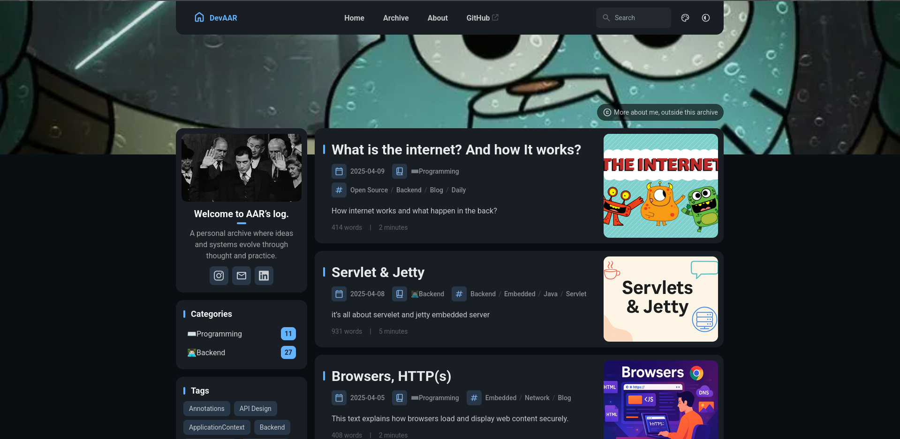

## DevAAR – AAR/log

Personal blog and evolving archive of ideas and systems, built with **Astro**, **Notion**, **Tailwind CSS** and **Swup**.  
The goal is to keep writing ergonomics in Notion, while serving a fast, fully static site at build time.

[**🖥️ Live Site**](https://log.aars.works)


<p align="center">
  
</p>


---

## Overview

- **Framework**: Astro (SSG, static output only)
- **Content source**: Single Notion database (`Blogs`)
- **Styling**: Tailwind CSS + custom CSS (including Notion block styles)
- **Client UX**: Swup page transitions, Pagefind-powered search
- **Deployment target**: Any static host (e.g. Vercel/Netlify), output in `dist/`

All blog posts, archive pages, category/tag pages, RSS and the About page are generated **statically** from Notion; there are **no runtime Notion API calls** in production.

---

## Architecture

- **Astro pages**
  - `src/pages/[...page].astro` – main paginated blog index (`/`, `/2`, …)
  - `src/pages/blog/[slug].astro` – individual blog posts (`/blog/my-post/`)
  - `src/pages/blog/category/[category].astro` – category archive pages
  - `src/pages/blog/tag/[tag].astro` – tag archive pages
  - `src/pages/about.astro` – About page, powered by a special Notion entry
  - `src/pages/archive.astro` – chronological archive
  - `src/pages/rss.xml.ts` – RSS feed
  - `src/pages/robots.txt.ts`, `src/pages/sitemap*` – SEO plumbing
- **Layouts & core components**
  - `src/layouts/Layout.astro` – root HTML shell, theme handling, meta tags, global scripts
  - `src/layouts/MainGridLayout.astro` – main shell with navbar, banner, sidebar, footer
  - `src/components/Navbar.astro` – site nav (`DevAAR` brand, nav links, theme switch)
  - `src/components/Footer.astro` – footer with archive tagline + RSS/Sitemap links
  - `src/components/widget/SideBar.astro` – profile card + category/tag widgets
- **Notion integration**
  - `src/lib/notion.ts` – Notion client, queries, block fetching, reading time
  - `src/lib/notion-renderer.ts` – Notion blocks → HTML renderer
  - `src/utils/content-utils.ts` – high-level helpers used by pages (sorting, filtering)
  - `src/utils/url-utils.ts` – URL helpers (`/blog/[slug]`, category/tag URLs)

---

## Notion Integration

### Database model

The site reads from a **single Notion database** named (logically) `Blogs`.  
Expected columns (Notion property names) and usage:

- **`title` (Title)** – post title
- **`slug` (Rich Text / plain text)** – unique slug, used as `/blog/[slug]/`
- **`status` (Select)** – `Draft | Published | Archived`
  - Only `Published` entries are included in the site
- **`category` (Select)** – e.g. `Programming`, `Trading`, `Math`, …
- **`tags` (Multi-select)** – tags used to build tag pages and tag lists
- **`summary` (Text)** – short summary, used on cards and RSS
- **`author` (Text or People)** – rendered in post footer and schema metadata
- **`thumbnail` (Files & Media)** – card and list cover image
- **`date` (Date)** – primary sort key, used as publication date
- **`updatedAt` (Last edited time)** – “last updated” metadata on posts

Special behaviour:

- **Portfolio / About**:
  - Any post with `category = "Portfolio"` and `slug = "about"` is **not** treated as a regular blog post.
  - It is excluded from:
    - main index
    - category lists
    - tag lists
  - It is used **only** as the content source for the `/about` page.

### Notion client and data flow

- The Notion client is created in `src/lib/notion.ts`:
  - Uses `@notionhq/client@^2.3.0` (v2 API) for compatibility with `databases.query`.
  - Auth is injected via `import.meta.env.NOTION_API_KEY`.
  - Database id is taken from `import.meta.env.NOTION_DATABASE_ID`.
- **At build time**:
  - `fetchPublishedPosts()` queries the `Blogs` DB and maps Notion properties into an internal `NotionPost` shape.
  - For each post, reading stats (`words`, `minutes`) are computed and cached, so list pages can display them without re-fetching blocks every time.
  - Individual post pages call `fetchPageBlocks(pageId)` and `renderNotionBlocks(blocks)` to get:
    - the rendered HTML
    - a heading map for the Table of Contents

---

## Environment Variables

Create a `.env` file in the project root (or use your platform’s secrets system) with:

```bash
NOTION_API_KEY="secret_notion_integration_token"
NOTION_DATABASE_ID="xxxxxxxxxxxxxxxxxxxxxxxxxxxxxxxx"
```

- **`NOTION_API_KEY`**
  - A Notion integration token with read access to the `Blogs` database.
  - Recommended scope: least privilege, read-only.
- **`NOTION_DATABASE_ID`**
  - The database ID from the Notion URL (the part after `/` in the database URL).

These are only used at **build time**; no secrets are exposed in the client bundle.

---

## Content & Rendering

- **Index / listings**
  - Main index (`/`, `/2`, …) uses `getSortedPosts()` from `content-utils` which:
    - pulls all `Published` posts from Notion
    - filters out the special Portfolio/About entry
    - sorts by `date` descending
  - Category and tag pages:
    - `src/pages/blog/category/[category].astro`
    - `src/pages/blog/tag/[tag].astro`
    - `getCategoryList()` / `getTagList()` build the sets of available categories/tags.
- **Single post pages**
  - `src/pages/blog/[slug].astro`:
    - resolves the matching `NotionPost` by slug
    - fetches the page blocks
    - runs `renderNotionBlocks(blocks)` to generate HTML + headings
    - recomputes words/minutes from the block content for display
    - passes `author`, `pubDate`, etc. into `License.astro` for the footer section.
- **Notion block renderer**
  - `src/lib/notion-renderer.ts` understands:
    - paragraphs, headings 1–3
    - bulleted/numbered lists (with nested children)
    - code blocks (`code`), with `language-xxx` classes for highlighters
    - images, callouts, toggles, to-dos, tables, quotes, bookmarks, embeds, videos, etc.
  - Output HTML is wrapped in `custom-md` class and styled via:
    - `src/styles/notion.css`
    - `src/styles/markdown.css`

---

## Styling & UX

- **Tailwind CSS**
  - Config: `tailwind.config.cjs`
  - Core styles:
    - `src/styles/main.css` – component-level utility classes
    - `src/styles/variables.styl` – CSS variables (colors, radii, etc.)
    - `src/styles/notion.css` – Notion-block-specific styling
    - `src/styles/markdown.css` – generic markdown typography/anchors/copy buttons
- **Code blocks**
  - Notion code blocks rendered as:
    - `div.notion-code-block > pre > code.language-xxx`
  - Background & text colors are tuned for readability in both light and dark mode.
  - No “selected-like” per-line overlays; just a clean block with mono font.
- **Swup (page transitions)**
  - Configured via the `@swup/astro` integration in `astro.config.mjs`.
  - Main container with transitions: `#swup-container` in `MainGridLayout.astro`.
  - Additional hooks in `Layout.astro` handle:
    - banner height & navbar visibility
    - TOC visibility
    - smooth scroll and page-height extension during transitions.
- **Search (Pagefind)**
  - The build runs `pagefind --site dist` after `astro build`.
  - Search UI lives in a Svelte component under `src/components/Search.*`
  - Only elements marked with `data-pagefind-body` are indexed.

---

## Running Locally

### Prerequisites

- Node.js **≥ 20**
- `pnpm` **≥ 9** (enforced via `preinstall` script)

### Install

```bash
pnpm install
```

### Development

```bash
pnpm dev
```

Then open `http://localhost:4321`.

During development:

- Astro dev server runs in SSG mode.
- Notion data is fetched on-demand; heavy block fetching is cached in-memory to keep iteration fast.

### Production build

```bash
pnpm build
```

This will:

1. Run `astro build` into `dist/`
2. Run `pagefind --site dist` to generate the search index

You can then preview the production build with:

```bash
pnpm preview
```

---

## Configuration

Main configuration lives in `src/config.ts`:

- **`siteConfig`**
  - `title`: `"AAR/log"`
  - `subtitle`: `"Archive"`
  - `lang`: `"en"`
  - `themeColor`: hue/fixed toggle for theme color picker
  - `banner`: banner image source, position (`top|center|bottom`) and credit (text + URL)
  - `toc`: TOC enabled flag and depth
- **`navBarConfig`**
  - Static nav links (`Home`, `Archive`, `About`, external GitHub)
- **`profileConfig`**
  - Avatar image path
  - Display name and short bio (sidebar)
  - Sidebar social links (Instagram, e‑mail, LinkedIn)
- **`licenseConfig`**
  - Name + URL for the license reference shown in the post footer.

Any brand/visual tweaks should be done via `config.ts`, Tailwind classes, or the CSS variables in `variables.styl` rather than touching the core logic.

---

## SEO & Feeds

- **Sitemap**
  - Provided by `@astrojs/sitemap`, using the `site` value from `astro.config.mjs`:
    - `site: "https://log.aars.works/"`
  - Output sitemap index: `/sitemap-index.xml`
- **RSS**
  - Implemented in `src/pages/rss.xml.ts` via `@astrojs/rss`.
  - Uses Notion-powered posts via `getSortedPosts()` and `siteConfig` for metadata.
- **Robots**
  - `src/pages/robots.txt.ts` serves a robots.txt matching the current host and sitemap.

---

## License & Credits

- The project is based on an open-source Astro blog theme, heavily adapted to use Notion as a CMS and to match the **DevAAR / AAR/log** branding.
- Unless otherwise stated, the code remains under the **MIT License**.

When reusing or extending this codebase, please keep license headers intact and credit both the original theme author and DevAAR where appropriate.
